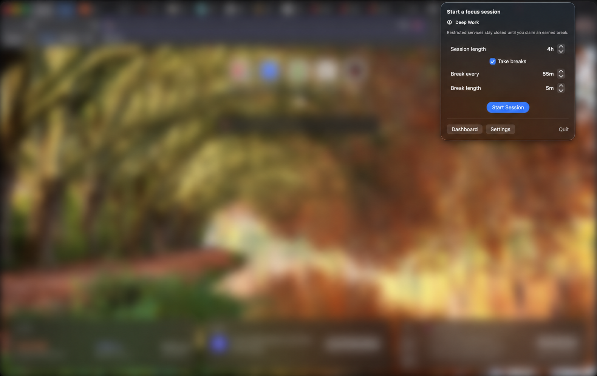
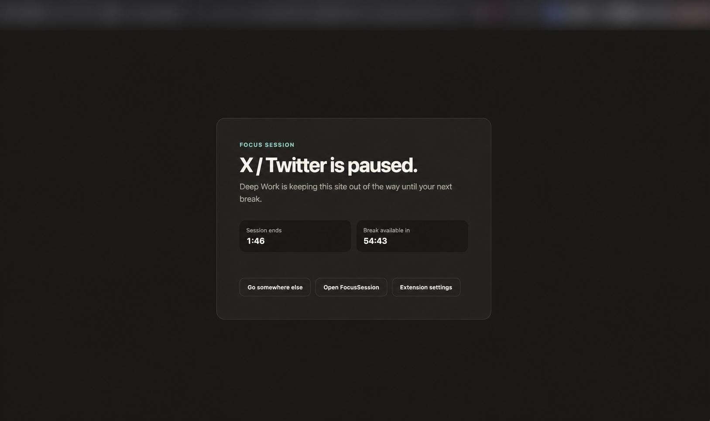
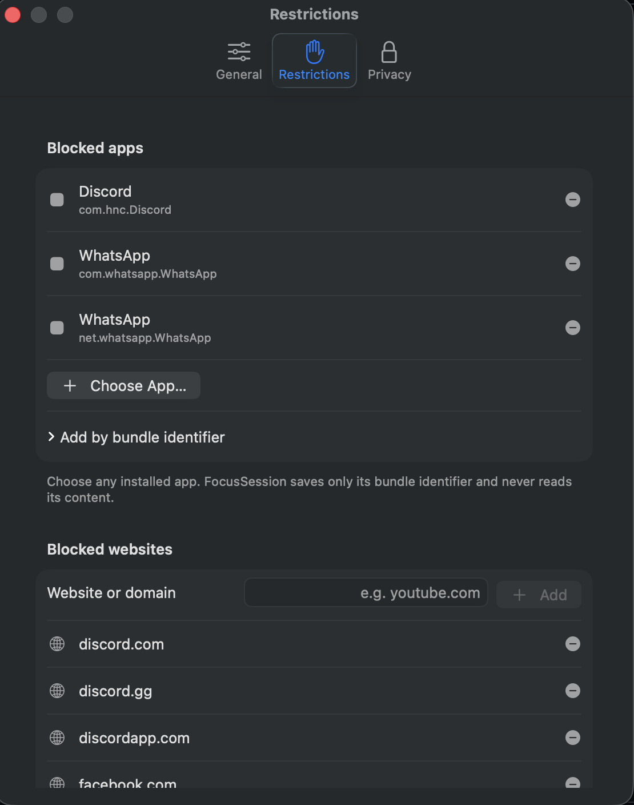

# FocusSession

FocusSession is a private, local-first macOS menu-bar app for deliberate work
sessions. It blocks configured native apps and Chrome/Brave websites during
focus intervals, then makes them available during manually claimed breaks.

This repository contains a working, dependency-light development v1:

- SwiftUI menu-bar app and local session engine
- Chrome/Brave Manifest V3 extension
- Local Chromium native-messaging bridge
- Aggregate-only local statistics and distraction suggestions
- Product specification, privacy contract, architecture, and acceptance tests

There is no account, backend, telemetry, analytics, subscription, AI model,
third-party runtime dependency, or application network client.

## Screenshots

Start a timed focus session from the macOS menu bar and choose whether to earn
breaks. Browser content in this screenshot is intentionally blurred for
privacy.



Opening a restricted site leads to a local blocked page with the remaining
session time and the next available break. The browser toolbar is intentionally
obscured for privacy.



Configure native apps and websites from one local settings screen.

<p align="center">
  
</p>

## Current status

The browser and Swift automated suites pass on Apple-silicon macOS with the
macOS 26 SDK. GitHub Actions runs the same `./scripts/verify.sh` command for
every push and pull request.

Treat this as a development build until the hands-on checks in
`docs/ACCEPTANCE_CRITERIA.md` have been run on the target Mac and browsers.
The app is ad-hoc signed for local use, not notarized for public distribution.

## Quick start on the Mac

Requirements:

- macOS 14 or later (currently validated on Apple silicon with macOS 26)
- Xcode 15.3 or later with its command-line tools selected
- Chrome 121 or later and/or Brave
- Node.js 20 or later only if you want to run the verification suite

Start with the read-only setup check:

```sh
./scripts/doctor.sh
```

It reports missing requirements and does not install or change anything.

### 1. Load the extension

1. Open `brave://extensions` or `chrome://extensions`.
2. Enable **Developer mode**.
3. Choose **Load unpacked**.
4. Select the `BrowserExtension` directory in this project.
5. Copy the 32-letter extension ID shown by the browser.

If using both browsers and they show different IDs, copy both.

### 2. Build and install the local app/bridge

From this repository:

```sh
./scripts/install-dev.sh EXTENSION_ID
```

For two different IDs:

```sh
./scripts/install-dev.sh CHROME_EXTENSION_ID BRAVE_EXTENSION_ID
```

The script:

- builds both Swift executables;
- creates `~/Applications/FocusSession.app`;
- places the native helper inside that app bundle;
- registers the exact extension origins with Chrome and Brave;
- ad-hoc signs the development app; and
- opens FocusSession.

Quit and reopen Chrome/Brave once after registration. Open the extension's
settings page and confirm that it says it is connected to the macOS app.

### 3. Configure

In FocusSession Settings:

- use the default **Deep Work** profile, create additional profiles, and choose
  which profile is active;
- start with Facebook, Messenger, Instagram, and WhatsApp blocked, then add a
  website by pasting its domain or URL, or add a native app with the app picker;
- keep the default Strict `55/5` pattern or choose Standard `50/10`, Long Focus
  `90/10`, or custom minutes for each profile;
- review the native-app bundle identifiers and restricted domains;
- enable Launch at Login if native-app blocking should resume automatically
  after a Mac restart;
- review local session history, which is on by default;
- opt into aggregate app/domain observation and suggestions if wanted; both are
  off on a fresh install;
- optionally enable notifications; and
- optionally configure two user-created Apple Shortcuts for starting and
  stopping Work Focus.

Before starting, choose the session length and configure how often breaks are
earned and how long they last. Breaks can be turned off for an uninterrupted
session. Every start uses a cancellable three-second countdown.

## Session rules implemented

- Sessions have absolute end times; sleep and restart never extend them.
- Session length, break frequency, and break length are configurable before
  starting.
- Choosing no breaks keeps restrictions active until the absolute session end.
- One break is earned after a focus interval and must be claimed manually.
- Unclaimed breaks do not accumulate.
- All configured restricted services are available during a claimed break.
- A blocked browser page automatically returns to the requested service when a
  break starts; only the normalized service domain is carried between pages.
- In the final ten seconds, a `+30 seconds` shot-clock control appears. It can
  be used again each time the extended timer returns to ten seconds.
- An extension never moves the overall scheduled end.
- Restricted native apps are hidden rather than quit. If macOS or an
  Electron app does not accept the hide request immediately, FocusSession
  covers its content with an opaque local focus shield until the user
  switches away; the restricted app's process remains running.
- Restricted browser tabs return to a bundled local blocked page at break end.
- Ending early uses one confirmation and is recorded locally when history is
  enabled.
- The browser cache expires itself at the absolute scheduled end, even if the
  native app is unavailable.

## Project map

| Path | Purpose |
|---|---|
| `macOS/` | Swift app, session engine, native host, and Swift tests |
| `BrowserExtension/` | Chrome/Brave extension, local pages, and Node tests |
| `docs/PRODUCT_SPEC.md` | Agreed v1 behavior and scope |
| `docs/ACCEPTANCE_CRITERIA.md` | Release-gate behaviors and manual checks |
| `docs/ARCHITECTURE.md` | Component and recovery design |
| `docs/PRIVACY.md` | Allowed/prohibited data and permissions |
| `docs/NATIVE_PROTOCOL.md` | Flat local native-messaging contract |
| `docs/UI_BRAND_ROADMAP.md` | Researched UI, identity, and logo task backlog |
| `AGENTS.md` | Setup path and invariants for coding agents |
| `CHANGELOG.md` | User-visible release history |
| `CONTRIBUTING.md` | Contribution workflow |
| `SECURITY.md` | Vulnerability-reporting and support policy |
| `scripts/doctor.sh` | Read-only setup diagnostic |
| `scripts/install-dev.sh` | Reversible development installer |
| `scripts/uninstall-dev.sh` | Removes app/bridge; preserves data unless explicitly asked |
| `scripts/verify.sh` | Browser tests/checks plus Swift tests when on macOS |

## Verify

On macOS with Xcode/Swift and Node 20 or later:

```sh
./scripts/verify.sh
```

This validates the extension manifest, checks the setup scripts, runs the
browser suite and syntax checks, and runs:

```sh
swift test --package-path macOS
```

To smoke-test a compiled native host:

```sh
node scripts/smoke-native-host.mjs \
  /absolute/path/to/FocusSessionNativeHost
```

## Local data and privacy

Native state is stored in:

```text
~/Library/Application Support/FocusSession/state.json
```

The app stores exact configured hostnames, aggregate observation domains,
bundle identifiers, aggregate durations/counts, session timestamps, and
settings. It does not store page titles, full URLs, URL paths or queries,
messages, page content, screenshots, window titles, or keystrokes.

Privacy defaults on a fresh install:

- session history is local and on;
- prospective app/domain observation is off;
- distraction suggestions are off;
- browser-history permission is not granted; and
- notifications, Launch at Login, and Work Focus Shortcuts are off.

The optional 30-day history analysis starts only from an explicit action in the
extension settings. Chrome/Brave supplies history locally; the extension
reduces it in memory to base-domain visit count and recency before sending it
to the native app. The full contract and threat model are in
`docs/PRIVACY.md`.

## Development-build boundaries

- Safari is deferred.
- The app is not notarized or packaged for public distribution.
- Disabling the extension, quitting the native app, using another browser, or
  ending early remains possible by design. This is deliberate friction, not a
  parental-control security boundary.
- Native app hiding, Launch at Login, notifications, Work Focus Shortcuts, and
  Chrome/Brave behavior still require hands-on validation on each target Mac.
- Screen Time history is not accessed through private databases, Full Disk
  Access, or UI automation. The supported-public-API feasibility check remains
  documented as a separate spike.

## Remove the development install

```sh
./scripts/uninstall-dev.sh
```

This removes the app, helper, and Chrome/Brave host registrations. It preserves
settings and statistics so an uninstall does not silently erase data. The
script first unregisters FocusSession from Launch at Login; if macOS refuses
that step, it leaves the app installed and explains how to retry safely.

To remove the native app data as well:

```sh
./scripts/uninstall-dev.sh --delete-data
```

Remove the unpacked extension from each browser separately to clear that
browser profile's local extension cache.

## Contributing and license

Contributions are welcome; start with `CONTRIBUTING.md`. FocusSession is
available under the MIT License. See `LICENSE`.
