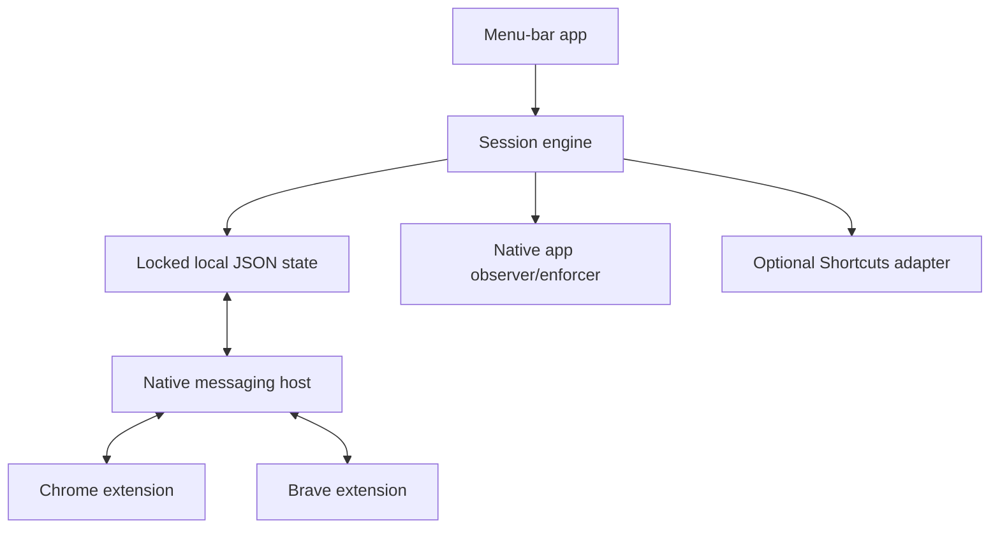
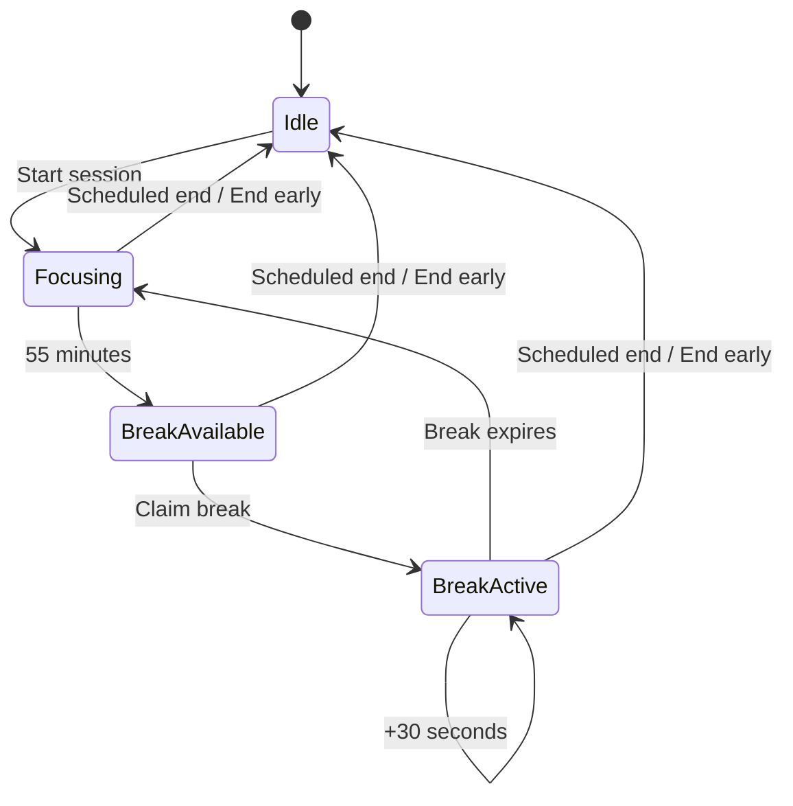

# FocusSession v1 Architecture

Status: current v1 prototype architecture  
Target: macOS 26, Apple silicon, Chrome and Brave

## System overview

FocusSession uses one native source of truth with independently expiring browser enforcement.



The menu-bar app and native host use the same `SessionService` and cross-process locked state file. Each running extension keeps a dedicated native state port open. Its native-host process watches the state directory and pushes a privacy-minimized public snapshot after changes. Each extension also caches that snapshot and can continue website enforcement until the absolute scheduled end if the native host is temporarily unavailable.

## Components

### 1. macOS menu-bar app

Recommended implementation: Swift, SwiftUI for windows/popovers, and AppKit where menu-bar or window behavior requires it.

Responsibilities:

- session commands and state-machine transitions;
- authoritative wall-clock state reconciliation;
- blocklist/settings editing;
- menu-bar countdown and shot-clock UI;
- notification scheduling;
- statistics and local-learning aggregation;
- active foreground-app observation;
- native-app hiding;
- native bridge coordination;
- launch-at-login registration; and
- optional Shortcut invocation.

The UI reads immutable state snapshots from the session engine. UI code does not independently mutate timestamps.

### 2. Session engine

The engine is a serialized actor or equivalent single-writer component. It owns:

- `sessionId`;
- `startedAt`;
- `scheduledEndAt`;
- current phase;
- `focusCycleStartedAt`;
- derived `focusAvailableAt`;
- `breakEndsAt`;
- completed-interval and extension counters;
- whether the Work Focus start shortcut succeeded.

All commands are evaluated against an injectable clock and committed atomically under in-process and cross-process file locks. Production persists wall-clock UTC instants. Remaining-second values are always derived from absolute deadlines.

#### Reconciliation algorithm

On every command, relevant timer event, wake, clock-change notification, launch, or client reconnection:

1. Load the latest valid active snapshot.
2. If `now >= scheduledEndAt`, complete the session and clear enforcement.
3. If `onBreak` and `now >= breakEndsAt`, begin a new focus interval at `breakEndsAt`.
4. If `focusing` and `now >= focusAvailableAt`, enter `breakAvailable`.
5. Never synthesize more than one available break.
6. Persist any transition atomically, then return the new public snapshot.

For a large time jump after a break expiry, the new focus interval begins at the persisted break expiry. Reconciliation may therefore make the next break immediately available if 55 wall-clock minutes have also passed, but it still yields at most one pending break. This preserves wall-clock semantics without accumulating break credits.

### 3. Native app observer and enforcer

Use `NSWorkspace` application-activation notifications as the primary foreground signal.

- Match restricted apps by signed bundle identifier, not localized name.
- During restricted phases, call the supported hide operation on matching running applications.
- Never issue terminate, force-terminate, or process-kill operations.
- During active breaks, use activation/deactivation transitions to aggregate only frontmost time.
- At session start and break expiry, enumerate the small configured restricted-app set and hide matches.

First implementation spike: verify whether supported
`NSRunningApplication.hide()` behavior is sufficient for configured native
apps on macOS 26. Only if it is insufficient may the app use Accessibility,
and then only for the narrow hide/focus-management capability with explicit
opt-in. Screen Recording and Full Disk Access are prohibited.

The native floating HUD explains a block event and then dismisses itself. During the final ten seconds of a break, a separate floating native shot-clock panel appears while a configured restricted app is foregrounded and offers `+30 seconds`. It is a FocusSession-owned panel and does not inspect restricted window content.

### 4. Chromium extension

One Manifest V3 codebase supports Chrome and Brave.

Responsibilities:

- reduce active tab hostnames to aggregate domains using the same bundled common compound-suffix table as the native app;
- preserve configured block entries as exact normalized hostnames and match only those hosts or their child subdomains;
- enforce the configured domain blocklist with dynamic rules and/or earliest supported navigation interception;
- render bundled blocked and shot-clock pages;
- route blocked-page `Open FocusSession` to `focussession://open` and `Extension settings` to the browser options page;
- observe active tab/window transitions and report domain-only context;
- cache the last validated native snapshot in `chrome.storage.local`;
- maintain a persistent `connectNative` state port and apply unsolicited state snapshots;
- retain a one-minute request-based state refresh as fallback;
- close or redirect known restricted tabs when a break expires;
- request optional `history` permission only from a user gesture;
- aggregate the optional 30-day history scan before native transfer; and
- synchronize state through native messaging.

The extension must not:

- use `chrome.storage.sync`;
- inspect DOM content except its own bundled pages/overlay;
- persist or transmit full URLs or titles;
- load remote scripts, fonts, images, analytics, or configuration; or
- keep a busy service worker alive.

The packaged app registers the `focussession` URL scheme. In its explicit
`Open FocusSession` click handler, the blocked page directly navigates to only
`focussession://open`; the app activates without accepting browsing context in
the URL. The `Extension settings` click asks the background worker to call
`chrome.runtime.openOptionsPage()` and remains browser-local.

#### Domain normalization

v1 deliberately does not ship a complete Public Suffix List. Native and browser code bundle an identical, versioned set of common compound suffixes. The table is used only to reduce observed/history hostnames for aggregates: a known compound suffix retains one additional label, while an unknown suffix falls back to the final two labels.

Blocking does not use that reduction. Each configured entry is stored as the exact normalized hostname, then matches only itself or its child subdomains. Suggestions are limited to a bundled catalog of known distraction domains rather than arbitrary fallback aggregates. Therefore an unknown compound suffix can make statistics less precise but cannot broaden a restriction. Replacing the common table with a complete, updateable PSL is deferred.

#### Offline enforcement

The extension derives a local decision:

```text
restrict =
  cached session exists
  AND now < scheduledEndAt
  AND active domain is configured as restricted
  AND NOT (phase is onBreak AND now < breakEndsAt)
```

`scheduledEndAt` is a mandatory safety expiry. A stale snapshot may preserve restriction only until that instant. On a native refresh, the extension replaces its cached snapshot with the request's returned authoritative state. The extension serializes its state-changing requests because v1 has no revision field.

Starting or extending a break requires a live native-host request because those commands are global across browsers and profiles. If disconnected, the extension retains safe enforcement and offers to open/relaunch FocusSession.

### 5. Native-messaging host

Chromium Native Messaging launches the bundled `FocusSessionNativeHost`. One-shot requests use `sendNativeMessage`; a dedicated state channel uses `connectNative`. The host:

- validates the framed flat JSON protocol in `NATIVE_PROTOCOL.md`;
- creates a `SessionService` over the same local repository as the app;
- serializes state access with the repository's cross-process file lock;
- performs requested commands locally;
- returns one `{ok,state,error?}` response for each request;
- watches the Application Support state directory with a filesystem dispatch source; and
- after a 40 ms debounce, emits an unsolicited `{ok,state}` snapshot on a persistent port when native state changes.

Response writes from request handling and the directory watcher share a lock so frames never interleave. The native-host executable and allowed extension origins are installed with the app. Chrome and Brave host manifests are scoped to the exact production extension identifiers. There is no XPC or TCP listener and no network transport. v1 has push state but no revisions or request IDs, so the extension serializes mutating commands and treats every valid pushed/requested snapshot as a fresh authoritative view.

### 6. Persistence

The native repository stores one versioned Codable `PersistedState` in:

`~/Library/Application Support/FocusSession/state.json`

It contains:

- settings and normalized block rules;
- at most one active session;
- retained session records and counters;
- aggregate application/domain usage;
- suggestion review/dismissal state; and
- pending Work Focus cleanup state.

`state.lock` coordinates native-app and native-host processes with `flock`; an `NSLock` serializes threads within a repository instance. Writes use Foundation's atomic file-write option. The Application Support directory is mode `0700` and state/lock files are mode `0600`.

The extension uses `chrome.storage.local` for its privacy-minimized cache and buffered aggregates. It never uses `chrome.storage.sync`.

Persistence requirements:

- mutations occur inside locked read-modify-write transactions;
- active state is validated on read;
- extension caches contain no statistics or raw observation history;
- completed active state is deleted when history is disabled;
- the state file is excluded from iCloud/document synchronization.

### 7. Statistics aggregator

The app records transitions, not continuous samples:

- NSWorkspace reports native app activation changes.
- Browser extensions report normalized active-domain/window-focus changes.
- The aggregator closes the previous interval at the transition timestamp.
- On sleep, lock, browser disconnect, or app termination, open observation intervals close.

Every public native state includes the authoritative `historyEnabled` and `usageObservationEnabled` flags. On a true-to-false transition, the extension synchronously clears the related local buffer before starting any new observation work:

- history off clears blocked-attempt aggregates;
- usage observation off closes/removes the current activity segment and clears domain-activity aggregates.

An extension-local observation toggle may narrow collection further, but can
never enable collection when the corresponding native flag is false.

Each buffered attempt/activity item captures `sessionID`, `wasOnBreak`, and `historyEnabledAtObservation` when it is observed. These fields are part of its aggregate key and native request. The native service uses them for attribution rather than the session/phase/settings that happen to exist at flush time, and never assigns stale data to a different session.

The native store retains only service/domain-level counts and durations after validated attribution. Prospective usage may remain useful for local suggestions independently of retained session history.

The dashboard's `Protected session time` is computed from retained wall-clock session elapsed time minus claimed break time. It is intentionally not derived from app/domain observation and may include sleep, lock, or away time.

### 8. Optional Work Focus adapter

The adapter invokes user-selected shortcuts through supported macOS Shortcuts/App Intents integration.

- Start invocation is asynchronous and time-bounded.
- Success is recorded in active session state.
- End invocation runs only if start succeeded.
- A failure surfaces locally and does not roll back the session.
- FocusSession does not claim it can read, own, or perfectly restore macOS Focus state.

### 9. Login and lifecycle

Use supported `SMAppService` login-item registration or the current macOS 26 equivalent.

- On wake/launch: reconcile state before presenting UI or allowing configured native apps.
- On browser startup: open the persistent state port, request an initial state, and retain a one-minute request fallback.
- On state-directory change: each connected host reconciles and pushes the authoritative public snapshot and blocklist.
- On graceful app exit during a session: warn that native app blocking will stop, while browser cache remains until the scheduled end.
- On crash: a launch helper may restart the app; regardless, no component enforces past its absolute expiry.
- The development uninstaller first invokes the still-installed
  `FocusSessionApp --unregister-login-item`. During
  `applicationWillFinishLaunching`, this command unregisters
  `SMAppService.mainApp` when its status is `enabled` or `requiresApproval`;
  any already-unregistered state is a successful no-op, and the process exits
  without opening the ordinary app UI.
- A nonzero unregister result aborts the uninstall before app/native-host
  deletion and directs the user to turn Launch at Login off in FocusSession
  Settings before retrying. Only a successful result proceeds to stop the app
  and remove the app, native-host executable, and Chrome/Brave native-host
  manifests.
- The development uninstaller intentionally retains the Application Support
  directory's local settings/statistics by default and does not uninstall
  browser extensions. The explicit `--delete-data` option also removes the
  native Application Support directory after successful login-item cleanup.
  Browser extensions remain a separate user-controlled removal action.

## State model



`completed` is a persisted history outcome, not a long-lived enforcement state.

## Event timing

- Native enforcement and the initiating browser's mutation response target: within one second.
- Healthy push-port cross-browser convergence target: within one second.
- Push-unavailable fallback convergence target: no later than 60 seconds.
- Visible countdowns may update once per second.
- Hidden components use deadline timers and lifecycle events, not one-second polling.
- All stored timestamps are RFC 3339 UTC; UI renders them in the current local time zone.

## Security and bypass model

### Protected against

- impulsive opening of configured sites/apps;
- browser/app restart as a casual reset;
- native app crash causing an indefinite browser lock;
- accidental break overrun;
- background tabs/apps inflating usage statistics; and
- duplicate or concurrent extension commands.

### Not protected against

- the device owner ending the session early;
- disabling/uninstalling the extension;
- terminating/removing FocusSession;
- changing system time;
- another browser, browser profile without the extension, virtual machine, or another device;
- direct IP/proxy/VPN/domain-alias evasions; or
- administrator/root-level modification.

This is intentional v1 scope. Stronger anti-tamper behavior would conflict with the accepted easy-stop and safe-recovery requirements.

## Failure behavior

| Failure | Behavior |
|---|---|
| Native host unavailable | Extension enforces cached state until absolute end; global break commands ask to reopen the app; reconnect uses bounded backoff |
| Push port disconnected | Cached state remains safe; reconnect is scheduled and one-minute request refresh remains active |
| Extension disconnected | Native-app enforcement and session timing continue; browser is shown as unprotected |
| One browser profile missing extension | UI reports that profile/browser is not protected when detectable |
| State transaction fails | Preserve last valid state, show local error, do not create an indefinite new lock |
| Persisted state invalid | Fail open for that invalid state, retain privacy-safe diagnostic metadata, notify user |
| Shortcut fails | Session continues; show non-blocking local error |
| Notification denied | In-app timers and enforcement continue |
| Native hiding unavailable | Browser enforcement continues; native capability is visibly degraded |

## Resource strategy

- Event subscriptions replace frequent polling.
- Each persistent native host blocks on its input stream and filesystem dispatch source while idle; it does not poll the state directory.
- Native directory events are debounced for 40 ms to coalesce an atomic state write's related events.
- The extension retains a one-minute state request as a resilience fallback, not its normal propagation path.
- An open native port may keep the Manifest V3 worker and one small native-host process resident per browser/profile. Their idle cost is memory, not active CPU; no keep-alive timer or busy loop is added.
- Countdown rendering activates only while its UI is visible.
- Domain normalization and classification use bundled deterministic data.
- Browser-history reduction occurs in bounded chunks off the UI thread.
- Aggregate increments are buffered by the extension and committed in short locked JSON-state transactions.
- No network client, embedded server, AI runtime, screen capture, or content index is included.

Exact release limits are in `ACCEPTANCE_CRITERIA.md`.

## Deferred architecture decisions

- Safari WebExtension packaging and Safari native-app integration.
- Supported historical native-app Screen Time import, pending the public-API spike.
- Distribution, signing, notarization, and update mechanism.
- Strong/locked session mode.
- Cross-device or account-based synchronization.
- Native protocol revisions and request idempotency keys.
- Automatic removal of optional browser-history permission after a scan; v1 provides an explicit removal action.
- A complete Public Suffix List and its safe update mechanism; v1 uses one identical bundled common compound-suffix table for aggregate reduction.
